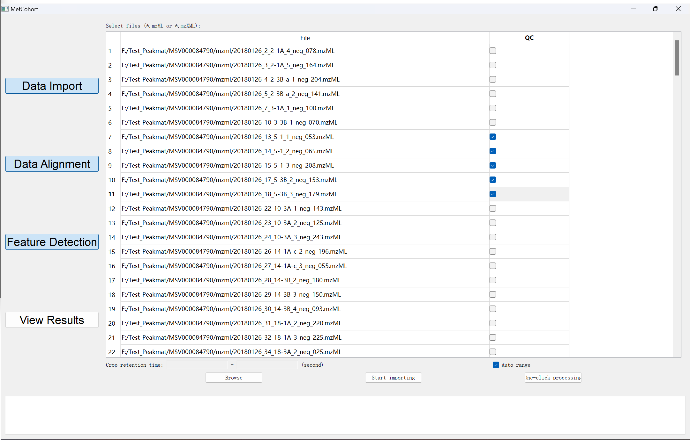
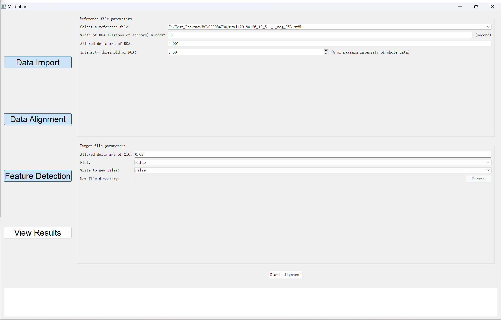
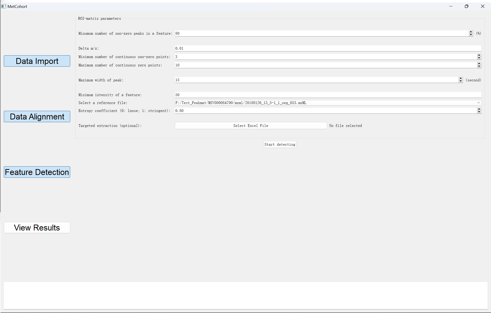
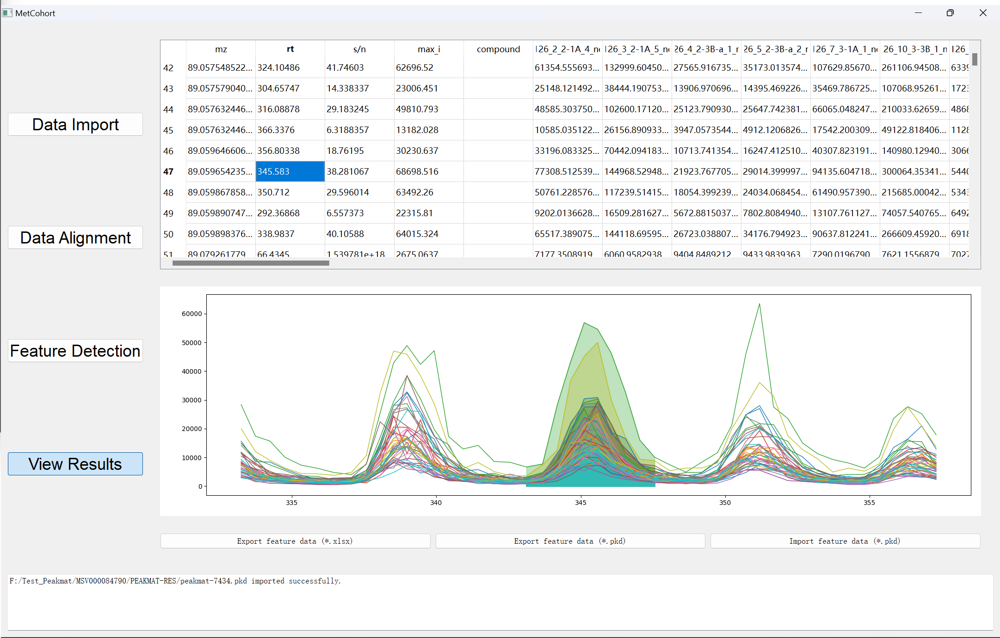
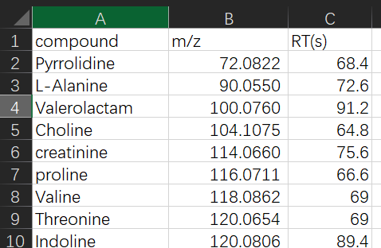
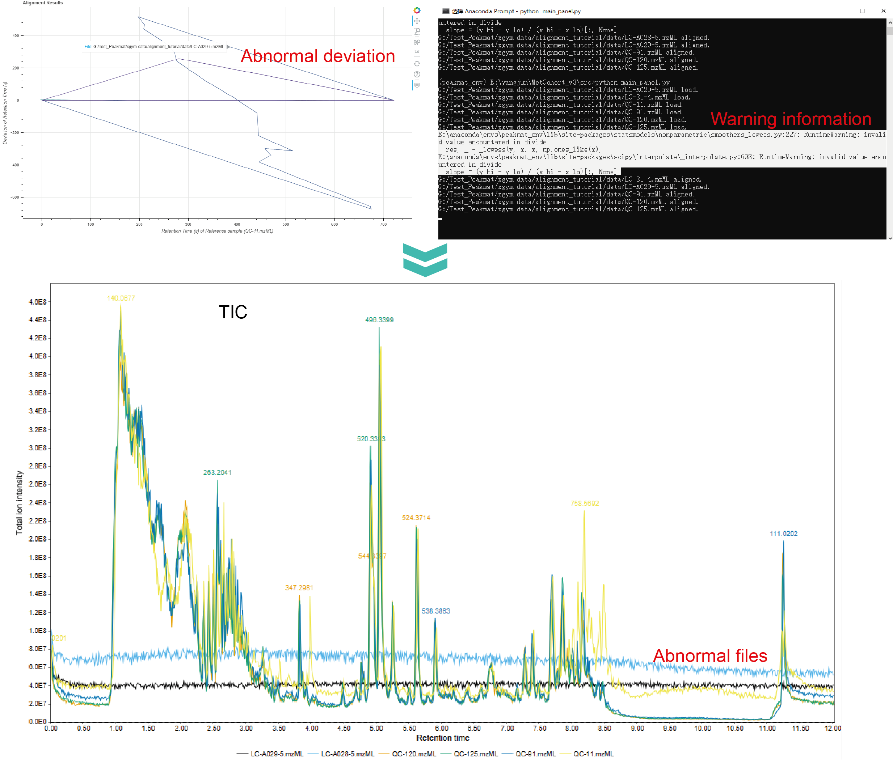
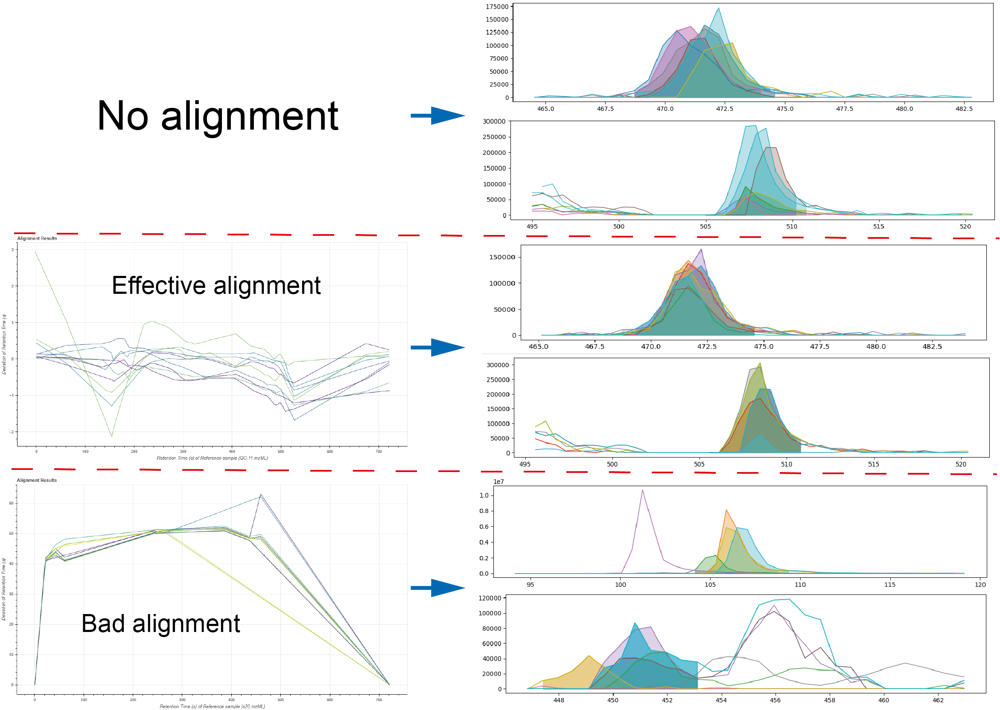

# MetCohort


MetCohort is an untargeted liquid chromatography-mass spectrometry 
(LC-MS) data processing tool for large-scale metabolomics and exposomics. MetCohort can 
realize automatic correction of retention time between samples and precise 
feature detection. With innovative and robust data correction and feature detection algorithm,
MetCohort have a low false positive and false negative rate simultaneously. 
Feature table of high quality is generated after whole procedures, which 
significantly improves subsequent feature annotation and statistical analysis.

MetCohort now supports mzML or mzXML file format of LC-MS raw data. At
least one file need to be specified as quality control (QC) file. 
Then data correction and peak detection should be performed in order. To optimize the processing
results, adjusting some parameters 
is necessary. Finally, feature detection results are visualized in the software and can be saved for 
subsequent analysis.

Detailed information about the algorithm and parameters are available in our article ([Anal. Chem. 2025, 97, 19, 10155–10162](https://pubs.acs.org/doi/10.1021/acs.analchem.4c04906)).

## Table of Contents

- [Software interface](#Software-interface)
- [User guide (Windows executable program)](#User-guide-Windows-executable-program)
- [User guide (Run from source code)](#User-guide-Run-from-source-code)
- [Parameters introduction](#Parameters-introduction)
- [The importance of raw data alignment](#The-importance-of-raw-data-alignment)
- [Potential solutions for poor alignment](#Potential-solutions-for-poor-alignment)
- [Important notes](#Important-notes)

## Software interface

Data import:

Data correction:

Feature detection:

Results visualization:



## User guide (Windows executable program)
Download the released .exe program from [Releases](https://github.com/JunYang2021/MetCohort/releases/download/MetCohort_exe/MetCohort_win11_x64_exe.zip) page.
Unzip the file and open the `MetCohort.exe` file.

## User guide (Run from source code)
### Step 1: Download source code of MetCohort
Download source code to local system from [Github](https://github.com/JunYang2021/MetCohort) page.

### Step 2: Install Anaconda
If you don't already have Anaconda installed on your system, follow these steps:

1. Download the Anaconda installer for your operating system from the [Anaconda download page](https://www.anaconda.com/products/individual).
2. Run the installer and follow the on-screen instructions.

### Step 3: Set up the environment
After installing Anaconda, set up the Python environment for running MetCohort.
1. Open Anaconda Prompt (or your terminal).
2. Create a new environment using the following command:
```shell
cd path_to_MetCohort   # the directory you downloaded MetCohort repository, windows system should drive to specific hard drive first
conda env create -f environment.yml
conda activate metcohort_env
```

### Step 4: Run MetCohort
With configured environment in Anaconda, MetCohort GUI can be activated with following command in Anaconda prompt:
```shell
cd path_to_MetCohort   # the directory you downloaded MetCohort repository, windows system should drive to specific hard drive first
cd ./src
python MetCohort.py
```


## Parameters introduction
### Data import
In Data Import stage, all the pending files (in mzML or mzXML format) need to be uploaded 
to the window. The QC files can be labeled. ROI detection is only performed on the labelled
QC files, which determine the construction of ROI matrix and ranges of features. Users can
select all the files as QC or only the representative files. For some experiments having 
blank or undesired signal at the beginning or ending of chromatographic gradient, users 
can uncheck the box of Auto range and set the real retention time in Crop retention time 
in seconds. 

_Note_: The files need to be centroided and in the same folder.


### Data alignment
In Data Alignment stage, users should select one reference file from labelled QC files 
for ROA detection. Changing the reference file may change the alignment results. Related parameters are shown below:


_**Width of ROA window**_: The time width of the ROA window. Default is 30 seconds. If the dead time is less than 30 s, it should be reduced.


_**Allowed delta m/z of ROA**_: Allowed m/z deviation in the process of ROA detection. 
Because the ROA width is short, a relatively narrow value should be set. The default 
value is 0.001.


_**Intensity threshold of ROA**_: An intensity coefficient to control the numbers of detected
ROAs. Specifically, the intensity at the center of a detected ROA should exceed a dynamic
specified value, which is calculated as the current EWMA (Exponentially weighted moving 
average) of TIC (total ion chromatograms) multiplied by the coefficient. The default 
coefficient is 0.5%. Lowering this value can increase the number of ROAs.


_**Allowed delta m/z of XIC**_: Allowed m/z deviation in the process of XIC extraction. 
It should be larger than allowed delta m/z of ROA to reach a good matching between files. 
The default value is 0.02.


_**Plot**_: Choose True or False to export the retention time deviation results of processed 
files in a html file. Abnormal files can be found from the resulting plot.


**_Write to new files_**: Choose True or False to export the raw data after data alignment
in mzML format. The exported files can be processed with other tools of LC-MS data 
processing.


_**New file directory**_: Select the exporting directory of new plots or files.


### Feature detection
In Feature Detection stage, related parameters are shown below:


_**Minimum number of non-zero peaks in a feature**_: Non-zero peaks should not exceed the 
specified proportion of all the samples. Default value is 80%.


_**Delta m/z**_: Allowed m/z deviation in the process of ROI detection and ROI matrix 
construction. Default value is 0.01. Actually, it can be adjusted to be narrower
following data alignment to enhance the peak resolution in feature detection.


_**Minimum number of continuous non-zero points**_: Allowed minimum number of continuous 
non-zero points in the process of ROI detection with centWave algorithm. Default
value is 3. In small-scale sample processing with a few QC files, the value should be
increased to decrease noise.


_**Maximum number of continuous zero points**_: Allowed maximum number of continuous zero 
points in the process of ROI detection with centWave algorithm. Default value is 10. 
It can control the number of ROI matrix through controlling the time length of detected 
ROIs.


_**Maximum width of peak**_: Allowed maximum chromatographic width of detected features. 
Default value is 15 seconds.


_**Minimum intensity of a feature**_: Allowed minimum intensity of a feature. 
If the maximum height of a feature in all the samples is lower than the value, 
the feature is filtered. Default value is 50.


_**Select a reference file**_: Select one reference file from the labelled QC 
files for feature representation. The retention time and m/z of one feature is 
represented by the retention time and m/z of the apex of the peak in the reference
file. It can be different from the reference file in raw data alignment. However, 
selecting the same file with reference file in raw data alignment is recommended,
because the feature representation can keep the same with any processing parameters 
with a fixed reference file. It can ease the process of feature matching between 
feature tables.


_**Entropy coefficient**_: A value ranging from 0 to 1 that controls the score 
threshold for feature determination in the ROI matrix. A larger entropy coefficient
corresponds to a higher threshold. The default value is set to 0.8. For large-scale
sample processing, users are advised to adjust this value lower.


_**Targeted extraction (optional)**_: A table of targeted extraction compounds in 
xlsx format. Users can optionally upload a table here for targeted extraction. 
The detailed style of the table is shown below:



_Note_: The feature detection of isomers or coeluting compounds and integration in targeted extraction
may be worse than the untargeted mode.


### View Results
After the feature detection stage, users can view the results on the View results
page of the window. When a feature is selected in the feature table, its chromatograms
are displayed. To conserve memory usage, chromatograms for a random selection of 
up to 50 files are shown. The shaded region in the chromatograms represents the 
integration region of the feature. Users can export the feature table in xlsx format 
using the button Export feature data (*.xlsx) in the window. Additionally, users can 
export and import the feature data within the window to save features and view them
in future sessions with Export feature data (*.pkd) and Import feature data (*.pkd)
buttons.


## The importance of raw data alignment
MetCohort performs a raw data-based alignment process before the feature detection. The quality
of the alignment can significantly influence feature detection and integration.
Therefore, it is necessary to manually inspect the alignment results during processing.
Users are encouraged to export the plot of retention time deviation during the data alignment
stage. The plot of retention time deviation will be included the exported file
directory as an HTML file. The plot serves two primary purposes:

### Identifying abnormal files
Inspecting the deviation plot can help identify abnormal files. In most cases, the 
retention time deviation is near 0 or exhibits a regular fluctuation. If extreme deviations
are observed in certain files, further investigation is necessary. Possible causes could include
differences in chromatographic conditions or inappropriate ROAs (Regions of Alignment) used for alignment.
In the HTML file exported from
MetCohort, users can hover the cursor over the abnormal deviation line to identify the specific file. 
For instance, in one analysis, the following plot was generated, and
the backend displayed warnings about LOWESS fitting. These warnings indicate issues with local matching.
Although they do not interrupt the workflow, they can lead to incorrect results. Upon examining the
TICs (Total Ion Chromatograms) of the files, it was found that the abnormal files contained
significantly noisy data. Identifying such abnormal files is crucial for large-scale sample analyses.



### Quality of data alignment impacts feature detection results

Effective data alignment is a prerequisite for obtaining reliable results, as feature detection 
is based on the aligned data. Although the algorithm of feature detection in ROI matrix doesn't strictly
divide the peak boundaries in a same position (we have a dynamic border identification in the ROI matrix), 
good alignment can make the true features being more easily identified and integrated. A bad data alignment can
reduce the feature numbers and negatively affect feature integration. The following image
demonstrates how data alignment impacts the quality of feature detection.

We can check the effectiveness
of data alignment from the retention time deviation plot. If the time deviation  does not correspond to the actual
retention time shift along the time axis, the data are not well aligned. Adjusting parameters, such as the reference file
or the number of ROAs, may improve the results.

If it is hard to find suitable parameters for data alignment and only little deviation is in the original data, 
it may be advisable to proceed with feature detection without performing alignment.



## Potential solutions for poor alignment

If irregular deviations appear in the deviation plot, consider the following solutions:
1. If only a few files exhibit irregular deviations, inspect their total ion chromatograms (TIC) using instrument software 
or publicly available tools like MZmine. If these files show significantly different elution patterns, the algorithm may 
struggle to align them correctly.
2. If most files show significant deviaitons that are unlikely to be real, try the following steps to adjust the parameters of data alignment:

   - Look at the message box for the `"xxx ROAs found."` message, which indicates the number of detected alignment anchors.
A normal range is approximately between **200 and 1000**; values outside this range may impact alignment performance.
If the number is too low, decrease the **"Intensity threshold of ROA"** parameter. Otherwise, increase it.
   - Selecting a different reference file may influence the alignment results.
   - If the chromatographic gradient is short or the dead time is less than 30 seconds, reducing the parameter 
**"Width of ROA window"** may improve alignment.
   - If significant compound-level deviations occur, the algorithm may be failing under such conditions.
3. For high-resolution mass spectrometry, m/z-related parameters generally do not require modification. 
4. If it is difficult to find optimal data alignment parameters and the raw data has a small deviation, users can directly perform 
feature detection without data alignment. Note that this approach may reduce the numbner of detected features, especially in large-scale samples.
Users can lower the parameter **"Entropy coefficient"** to decrease the threshold of feature detection.


## Important notes

1. MetCohort may produce erroneous results if the data is not well-aligned. It is necessary to check the deviation plot.
2. If poor alignment is encountered, carefully reviewing the parameters of data alignment may help adjust them for better results.
3. The alignment algorithm is not capable of handling compound-level deviations. If such cases are frequent in the data, the results of these features should be reviewed or removed.
4. If multiple features (more than 5) with different orders of magnitude are close in time, the lower-intensity feature may be obscured by the algorithm.
5. We welcome any discussions, feedback, or suggestions! Feel free to open an issue or start a discussion on our [Issues](https://github.com/JunYang2021/MetCohort/issues) page.
